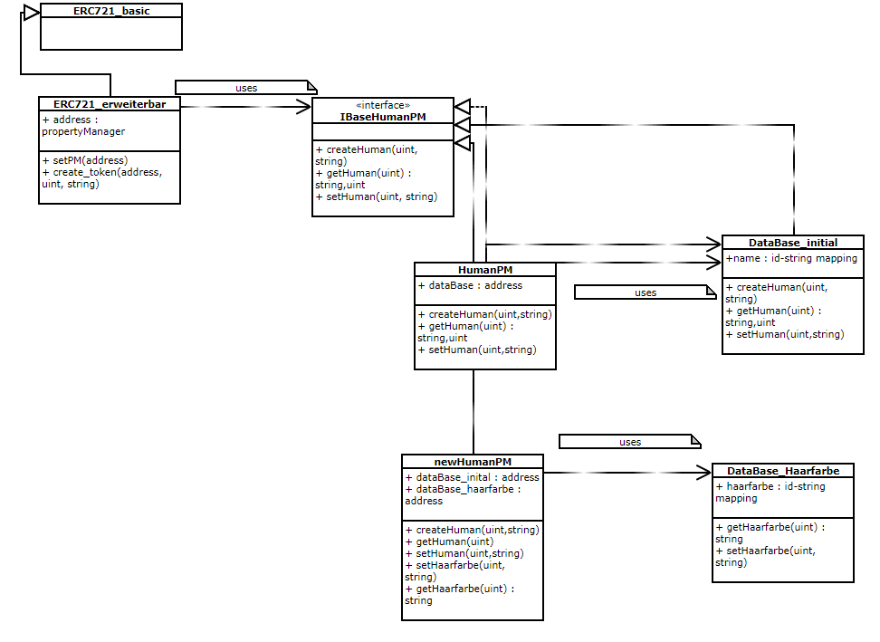

# ERC721 Beispiel Implementierung
Unsere Implementierung ist an folgenden Blog Eintrag angelehnt: [https://medium.com/blockchannel/walking-through-the-erc721-full-implementation-72ad72735f3c](https://medium.com/blockchannel/walking-through-the-erc721-full-implementation-72ad72735f3c).

Alle benötigten Interfaces und Libraries sind [hier](https://git.uni-konstanz.de/ja431gre/GenTokens/tree/develop/contracts) zu einzusehen.

Anmerkung: Der aktuelle ERC721 Standard hatte diverse veraltete Versionen. Dies führt dazu, dass zum Beispiel CryptoKitties nicht das aktuelle Interface Implementiert (vgl. [Source Code](https://etherscan.io/address/0x06012c8cf97bead5deae237070f9587f8e7a266d#code)). 

## Inhaltsverzeichnis
- [Standard ERC721 (Besitzverwaltung)](#standard-erc721-besitzverwaltung)
- [Eigenschaftenverwaltung on-chain](#eigenschaftenverwaltung-on-chain)

## Standard ERC721 (Besitzverwaltung)
Der ERC721 teilt viele Funktionen mit dem ERC20, allerdings unterscheidet sich die Implementierung signifikant. Da die Tokens nun nicht mehr beliebig austauschbar sind, reicht es nicht  mehr aus lediglich die Menge an Tokens zu speichern, die einer jeweiligen Adresse gehören. Im Folgenden werde ich lediglich die Verwaltung des Besitzes eines Tokens beschreiben. Wie mit den eigentlichen Eigenschaften eines Tokens umgegangen wird später beschrieben.

### Diesen Contract benutzen
Diese Standard ERC721 Implementierung ist in dem Ropston Testnetzwerk unter der Adresse `0x6fbd82e857b75ca1a6c9cf2eda52887f72f597c8` deployed. Der vollständige Source Code ist [hier](https://git.uni-konstanz.de/ja431gre/GenTokens/blob/develop/contracts/ERC721_basic.sol) zu finden.
Diesem Contract fehlen Rollenverteilungen und an gewissen Stellen ein Abgleichen von Rechten. Dies bedeutet, dass derzeit jeder Nutzer Tokens erstellen und sich selber zuweisen darf. 
Hierzu müssen Sie:
1. Remix öffnen und den Source Code kompilieren. (Stellen sie sicher, dass sie die passenden Interfaces und Libraries in Solidity geöffnet haben)
2. Über den "Run" Tab, den Contract "ERC721_basic" auswählen und den Contract über den Button "At Adress" dem Remix GUI bekannt machen. 
3. Die "create_token" Methode ausführen. "_to" sollte ihre Adresse sein und die "_tokenId" kann eine beliebige ganze Zahl sein. Falls diese ID bereits existiert, wird die Transaktion fehlschlagen. (Falls die Methode "OwnerOf" für eine TokenID die Adresse `0x0000000000000000000000000000000000000000` zurück liefert, ist diese ID noch nicht vergeben)
4. Um nun einen Token zu versenden, benutzen sie bitte die Methode "transferFrom", anstatt "safeTransferFrom". Eine Erklärung finden sie [hier](#safetransfer)

### Persistente Daten
Jedes unserer Token ist durch eine ID des Typen `uint256` eindeutig identifizierbar.
Um den Besitz von nicht-fungiblen Tokens zu verwalten, definieren wir 7 `internal` Datenstrukturen, welche innerhalb unserer Funktionen manipuliert werden (vgl. `balances` Mapping beim ERC20):

	uint256[] internal allTokens;
    mapping (address => uint256[]) internal ownedTokens;
    mapping(uint256 => uint256) internal ownedTokensIndex; 
    mapping (address => uint256) internal ownedTokensCount;
    mapping (uint256 => address) internal tokenOwner;
    
    mapping (uint256 => address) internal tokenApprovals;
    mapping (address => mapping (address => bool)) internal operatorApprovals;

- `allTokens`: Array aller erzeugter TokenIDs
- `ownedTokens`: Mapping von Account Adresse auf TokenID Array, welche diesem Account gehören
- `ownedTokensIndex`: Mapping von TokenID auf Index im Array aus `ownedTokens` des Besitzers. Dies ist sinnvoll um ein iterieren über das Array zu vermeiden.
- `ownedTokensCount`: Mapping von Account Adresse auf Anzahl Tokens, welche dieser Account besitzt. Dies ist notwendig, da beim Löschen eines Elements aus einem Array (z.B. beim Transfer des Tokens) in Solidity das Element nicht wirklich entfernt wird, sondern nur auf 0 gesetzt wird.
- `tokenOwner`: Mapping von TokenID auf Account Adresse des Besitzers
- `tokenApprovals`: Mapping von TokenID auf Adresse des Accounts, welcher die Genehmigung hat diesen Token zu handeln
- `operatorApprovals`: Speichert Genehmigung von einem Account (erster `address` Key) für einen anderen Account(zweiter `address` Key), alle seine Tokens zu handeln (bool). 

### Events
Hier nur der kurze Hinweis, dass 3 `Events` definiert sind, um Clients über state Manipulationen zu informieren:

	event Transfer(address indexed from, address indexed to, uint256 indexed tokenId);
    event Approval(address indexed owner, address indexed approved, uint256 indexed tokenId);
    event ApprovalForAll(address indexed owner, address indexed operator, bool approved);
 
Diese Events werden an passender Stelle von unseren Funktionen ausgelöst.

### Token Erstellung
Diese Funktionalität ist zwar im ERC721 Interface nicht definiert, jedoch für eine funktionale NFT-Implementierung notwendig. In dieser Beispielimplementierung sind keine Zugriffsrechte für das Erstellen von Tokens definiert, dies würde in einer realen NFT-Anwendung sicherlich anders gehandhabt werden.
    
    function _addTokenTo(address _to, uint256 _tokenId) internal {
        require(tokenOwner[_tokenId] == address(0));
		uint256 length = ownedTokens[_to].length;
        ownedTokensIndex[_tokenId] = length;
        tokenOwner[_tokenId] = _to;
        ownedTokens[_to].push(_tokenId);
        ownedTokensCount[_to] = ownedTokensCount[_to].add(1);
    }
    
    function create_token(address _to, uint256 _tokenId) external {
        require(_to != address(0));
        _addTokenTo(_to, _tokenId);
        allTokens.push(_tokenId);
        emit Transfer(address(0), _to, _tokenId);
    }   
    
Auf Grunde späterer Wiederverwendung, wurde das Erstellen von Tokens in zwei Methoden aufgeteilt:
- `_addTokenTo`: eine `internal` Methode, und daher nur von Methoden innerhalb des Contracts aufrufbar. Sie weist das Token mit der ID `_tokenId` dem neuen Besitzer `_to` zu und aktualisiert alle nötigen Datenstrukturen.
- `create_token`: die von außen aufrufbare Methode, welche die interne Methode `_addTokenTo` aufruft. Zusätzlich wird die neue `_tokenId` dem `allTokens` Array hinzugefügt und das `Transfer` Event wird ausgelöst.

### Erlaubnis für Transfer (Approval)
Bevor ich zum eigentlichen Transfer von Tokens komme, möchte ich das Approval beschreiben. Also das Vergeben einer Erlaubnis von Contract A an Contract B zum Transfer von Tokens im Besitz von Contract A. Wie bereit im Abschnitt *Persistente Daten* beschrieben, gibt es zwei Arten von Approvals. Zum Einen die Erlaubnis ein spezifisches meiner Tokens zu handeln und zum anderen die absolute Erlaubnis alle meine Tokens zu handeln. 
	
    function approve(address _to, uint256 _tokenId) public {
        address owner = tokenOwner[_tokenId];
        require(_to != owner);
        require(msg.sender == owner || isApprovedForAll(owner, msg.sender));
        if (getApproved(_tokenId) != address(0) || _to != address(0)) {
          tokenApprovals[_tokenId] = _to;
          emit Approval(owner, _to, _tokenId);
        }
    }
  
    function isApprovedForAll(address _owner, address _operator) public view returns (bool) {
        return operatorApprovals[_owner][_operator];
    }
      
    function getApproved(uint256 _tokenId) public view returns (address) {
        return tokenApprovals[_tokenId];
    }
     
    function setApprovalForAll(address _to, bool _approved) public {
        require(_to != msg.sender);
        operatorApprovals[msg.sender][_to] = _approved;
        emit ApprovalForAll(msg.sender, _to, _approved);
    }
- `approve`: Wenn der aufrufende Account die entsprechende Rechte besitzt, wird in `tokenApprovals` die übergebene Adresse `_to` für das Token `_tokenId` gesetzt. Dadurch erhält dieser Account das Recht, diesen Token zu handeln.
- `isApprovedForAll`: Prüft `operatorApprovals` ob der `_operator` für die Adresse `_owner` das absolute Recht hat alle seine Tokens zu handeln.
- `getApproved`: Ruft in `tokenApprovals` den Eintrag für `_tokenId` ab. Dieser ist die 0-Adresse: `0x0000000000000000000000000000000000000000`, falls keine Genehmigung vergeben wurde.
- `setApprovalForAll`: Vergibt das Recht, alle meine(des Aufrufers) Tokens zu handeln an `_to`. Bzw entzieht dieses Recht, falls für `_approved` `false` übergeben wird.

### Transfer
Anmerkung: Interessanter Weise definiert das ERC721 Interface keine einfache `transfer` Methode (anders als ERC20), welche es ermöglicht Tokens von dem aufrufenden Contract zu versenden. Stattdessen existiert nur noch die `transferFrom` Methode (auch im ERC20 definiert), welche die gleiche Funktionalität bietet, allerdings mit anderer Syntax.

Das eigentliche Übertragen von Besitz eines Tokens wird durch die folgenden Funktionen umgesetzt:

    modifier canTransfer(uint256 _tokenId) {
		address _spender = msg.sender
		address owner = tokenOwner[_tokenId];
        isApprovedOrOwner = _spender == owner || getApproved(_tokenId) == _spender || isApprovedForAll(owner, _spender);
        require(isApprovedOrOwner);
        _;
    }
    
    function transferFrom(address _from, address _to, uint256 _tokenId) public canTransfer(_tokenId) {
        require(_from != address(0));
        require(_to != address(0));
        _clearApproval(_from, _tokenId);
        _removeTokenFrom(_from, _tokenId);
        _addTokenTo(_to, _tokenId);
        emit Transfer(_from, _to, _tokenId);
    }

    function _clearApproval(address _owner, uint256 _tokenId) internal {
        require(tokenOwner[_tokenId] == _owner);
        if (tokenApprovals[_tokenId] != address(0)) {
          tokenApprovals[_tokenId] = address(0);
          emit Approval(_owner, address(0), _tokenId);
        }
    }

    function _removeTokenFrom(address _from, uint256 _tokenId) internal {
        require(tokenOwner[_tokenId] == _from);
        ownedTokensCount[_from] = ownedTokensCount[_from].sub(1);
        tokenOwner[_tokenId] = address(0);
    
        uint256 tokenIndex = ownedTokensIndex[_tokenId];
        uint256 lastTokenIndex = ownedTokens[_from].length.sub(1);
        uint256 lastToken = ownedTokens[_from][lastTokenIndex];
    
        ownedTokens[_from][tokenIndex] = lastToken;
        ownedTokens[_from][lastTokenIndex] = 0;
        ownedTokens[_from].length--;
        ownedTokensIndex[_tokenId] = 0;
        ownedTokensIndex[lastToken] = tokenIndex;
    }
- `canTransfer`: Modifier, welcher auf eine Funktion angewendet werden kann. Der Code des Modifiers wird vor den Code der Funktion ausgeführt (bzw. Funktionscode an der Stelle des `_;`). Dieser Modifier stellt sicher, dass der `msg.sender` die entsprechenden Rechte hat, um das Token mit der `_tokenId` zu handeln.
- `transferFrom`: Von außen aufzurufende Funktion um den Transfer des Tokens `_tokenId` von `_from` an `_to` anzustoßen. Die Funktion `_addTokenTo` wurde bereits im Abschnitt *Token Erstellung* beschrieben.
- `_clearApproval`: Interne Methode, welche die Genehmigung für das Handeln von `_tokenId` löscht, bzw. auf die 0-Adresse setzt.
- `_removeTokenFrom`: Löscht den Besitz von `_tokenId` von dem bisherigen Besitzer `_from`. Da es in Solidity kein wirkliches Löschen gibt, muss das Array von `_from` im `ownedTokens`-Mapping umständlich neu angeordnet werden. Das letzte Element im Array des bisherigen Besitzers `from` wird an die Stelle des Tokens mit der ID `_tokenId` verschoben und das letzte Element des Arrays wird auf 0 gesetzt.

### SafeTransfer
Ethereum definiert zwei verschiedene Arten von Accounts, einmal die externally owned accounts, welche zu einer Person (bzw. private Key) gehören und von denen Transaktionen gestartet werden können (z.B. über Remix oder Truffle). Außerdem gibt es auch Contract accounts, sie können keine Transaktionen starten(vgl [Doku](http://ethdocs.org/en/latest/contracts-and-transactions/account-types-gas-and-transactions.html)). Wenn ein Token nun jemals an einen Contract Account transferiert wird, dessen Contract nicht mit dem Token umgehen kann (also eine Möglichkeit zum Weitersenden o.ä. bietet), besteht keine Möglichkeit jemals wieder an dieses Token heranzukommen. Um dieses Problem zu umgehen wurde im aktuellen ERC721 die Methode `safeTransferFrom` eingeführt:

	function _safeTransferFrom(address _from, address _to, uint256 _tokenId, bytes _data) internal {
        require(checkAndCallSafeTransfer(_from, _to, _tokenId, _data)); 
        transferFrom(_from, _to, _tokenId);
    }
    
    function safeTransferFrom(address _from, address _to, uint256 _tokenId) external payable canTransfer(_tokenId) {
        _safeTransferFrom(_from, _to, _tokenId, ""); 
    }
    
    function safeTransferFrom(address _from, address _to, uint256 _tokenId, bytes _data) external payable canTransfer(_tokenId) {
        _safeTransferFrom(_from, _to, _tokenId, _data); 
    }

    function checkAndCallSafeTransfer(address _from, address _to, uint256 _tokenId, bytes _data) internal returns (bool) {
        if (!isContract(_to)) {
          return false; 
        }
        bytes4 retval = ERC721TokenReceiver(_to).onERC721Received(msg.sender, _from, _tokenId, _data);
        bytes4 ERC721_Hash_Expected = 0x150b7a02;
        return (retval == ERC721_Hash_Expected );
    }

    function isContract(address addr) internal view returns (bool) {
        uint256 size;
        assembly { size := extcodesize(addr) }  
        return size > 0;
    }
    
- `safeTransferFrom`: überladene externe Methode mit optionalem `bytes` Parameter `_data`. Sie ruft die interne Methode `_safeTransferFrom` auf, welche zuerst überprüft ob die Adresse `_to` zu einem Contrct gehört, dieser Contract behauptet mit ERC721 Tokens umgehen zu können, bevor die oben beschriebene `transferFrom` Methode aufgerufen wird. Die Methode ist `payable` um eventuell dem anzusprechendem Contract `_to` ether mit zu senden.
- `checkAndCallSafeTransfer`: Überprüft ob `_to` ein Contract ist und ruft danach die `onERC721Received` Methode auf dem Contract  `_ to` auf. Es wird angenommen, dass der Contract `_to` mit ERC721 Tokens umgehen kann, wenn er das Interface ERC721TokenReceiver (vgl. [Interface](https://git.uni-konstanz.de/ja431gre/GenTokens/blob/develop/contracts/Interfaces/Interface_ERC721TokenReceiver.sol)) implementiert und die ERC-165 Identifikation (vgl. [ERC-165-Erklärung](https://git.uni-konstanz.de/ja431gre/GenTokens/blob/develop/documentation/faq.md)) der Methode `onERC721Received` bei dessen Aufruf zurück gibt. Die ERC-165 Identifikation entspricht `0x150b7a02`. Nur wenn dieser erwartete Wert zurückgegeben wird, liefert die Methode `true` zurück.
- `isContract`: Utility Methode um zu überprüfen, ob an der gegebenen Adresse `addr` ein Contract Account liegt. Falls dies der Fall ist, muss dort Code liegen.

### ERC-165 Implementierung
Durch die Implementierung der im ERC-165 definierte Methode `supportsInterface` teilt der Contract möglichen anfragenden Akteuren mit, dass er sowohl ERC165 als auch ERC721 implementiert

	bytes4 constant InterfaceSignature_ERC165 = bytes4(keccak256('supportsInterface(bytes4)'));
    bytes4 constant InterfaceSignature_ERC721 =
        bytes4(keccak256('balanceOf(address)')) ^
        bytes4(keccak256('ownerOf(uint256)')) ^
        bytes4(keccak256('safeTransferFrom(address,address,uint256,bytes)')) ^
        bytes4(keccak256('safeTransferFrom(address,address,uint256)')) ^
        bytes4(keccak256('transferFrom(address,address,uint256)')) ^
        bytes4(keccak256('approve(address,uint256)')) ^
        bytes4(keccak256('setApprovalForAll(address,bool)')) ^
        bytes4(keccak256('getApproved(uint256)')) ^
        bytes4(keccak256('isApprovedForAll(address,address)'));
        
     function supportsInterface(bytes4 interfaceID) external view returns (bool) {
         bool isERC165 = (interfaceID == InterfaceSignature_ERC165);
         bool isERC721 = (interfaceID == InterfaceSignature_ERC721);
         return (isERC721 || isERC165);
     }

### Sonstige Funktionen
Folgende Funktionen wurden zusätzlich definiert, um dem ERC721 Interface zu entsprechen:

    function balanceOf(address _owner) external view returns (uint256) {
        return ownedTokensCount[_owner];
    }
    
    function ownerOf(uint256 _tokenId) external view returns (address) {
        return tokenOwner[_tokenId];
    }
    
- `balanceOf`: Stellt eine öffentliche Schnittstelle für das `ownedTokensCount` Mapping zur Verfügung, um abfragen zu können, wie viele Tokens ein Account besitzt
- `ownerOf`: Stellt eine öffentliche Schnittstelle für das `tokenOwner` Mapping zur Verfügung, um abfragen zu können, wer der Besitzer eines bestimmten Tokens ist.

## Eigenschaftenverwaltung on-chain
Nun da wir einen Contract zur [Besitzverwaltung](#standard-erc721-besitzverwaltung) von ERC721 Tokens definiert haben, können wir uns um die eigentlichen Eigenschaften der verwalteten Tokens kümmern. In diesem Abschnitt werden die Möglichkeiten erläutert, die Eigenschaften exklusiv auf der Blockchain zu speichern. Insbesondere werden wir auf die Änderbarkeit und Erweiterbarkeit der Eigenschaften eingehen.

### Contract mit Eigenschaften
In dem folgenden Beispiel ([ERC721_mit_Eigenschaften_onchain](https://git.uni-konstanz.de/ja431gre/GenTokens/tree/master/contracts/ERC721_mit_Eigenschaften_onchain.sol)) werden die Eigenschaften der Tokens in einer `struct`, einem quasi-Object gespeichert. Der Contract übernimmt zusätzlich alle Eigenschaften des *ERC721_basic* Contracts, erbt also von ihm:

    struct Human {
        string name;
        uint256 groesse;
    }
    
    mapping(uint256 => Human) allHumans;
    
    function create_token(address _to, uint256 _tokenId, string _humanName, uint256 _humanGroesse) external {
        super.create_token(_to, _tokenId);
        
        Human storage newHuman = allHumans[_tokenId]; //create new Human
        newHuman.name = _humanName;
        newHuman.groesse = _humanGroesse;
    }   
    
    function getHuman(uint256 _tokenId) public view returns (string, uint256) {
        Human memory theHuman = allHumans[_tokenId];
        return (theHuman.name, theHuman.groesse);
    }
Die Funktion `create_token` wird überladen, um die Möglichkeit zu bieten, Tokeneigenschaften beim Erstellen mit zu übergeben. Im Beispiel repräsentieren unsere Tokens einen Menschen, welcher zunächst einen Namen und eine Größe besitzt. Zusätzlich wird die Funktion `getHuman` hinzugefügt, um die Eigenschaften eines Tokens abfragen zu können.

### Eigenschaften ändern
Die Eigenschaften eines Tokens zu ändern, funktioniert unspektakulärerweise in diesem Kontext genau gleich wie in jeder anderen Programmiersprache, indem wir eine setter-Methode definieren:
    
    function setHuman(uint256 _tokenId, string _humanName, uint256 _humanGroesse) public canTransfer(_tokenId) {
        Human storage theHuman = allHumans[_tokenId];
        theHuman.name = _humanName;
        theHuman.groesse = _humanGroesse;
    }
    
Natürlich könnte man auch Funktionen zum exklusiven updaten des Namens bzw. der Größe zur Verfügung stellen. Der modifier `canTransfer(_tokenId)` ist im Basic Contract definiert und stellt sicher, dass der Ausführende der Transaktion entweder Besitzer des Tokens mit der id `_ tokenId` ist, oder die Genehmigung zum handeln erhalten hat. Weitere Rechteeinschränkungen oder ein Preis für diese Funktion sind denkbar.

### Eigenschaften erweitern
Um einen Mechanismus zu implementieren, in dem die Definition eines `Human` geändert werden kann, muss eine komplexere Vorgehensweise gewählt werden. 

#### 1.Vorgehensweise: Modulare Contract Architektur
Diese Vorgehensweise bietet zwar eine Möglichkeit, Contracts Erweiterbar zu machen, offenbart allerdings signifikante Sicherheitsrisiken. Man kann die Erweiterbarkeit erreichen, indem der Contract modular gestaltet wird (vgl. [hier](https://git.uni-konstanz.de/ja431gre/GenTokens/blob/master/documentation/modulare_contract_architektur.md)) und die Datenspeicherung und -verwaltung an andere Contracts ausgelagert wird und diese Contracts ausgetauscht werden können.

Diese Architektur basiert auf dem *ERC721_basic* Contract, wobei der *ERC721_erweiterbar*  Contract von ihm erbt. Dieser Contract ist nur durch das Attribute `propertyManager` erweitert, welches die Adresse des Contracts beinhaltet, der gerade die Eigenschaften für die Tokens verwaltet.

Angenommen im ersten Schritt wird der Token veröffentlicht und besitzt nur eine Eigenschaft `name`. Zuerst wird der `DataBase_initial` contract deployed, danach der `HumanPM` mit der Referenz auf den `DataBase_initial`. Nun wird beim Deployment des `ERC721_erweiterbar` die Adresse des `HumanPM` als `propertyManager` gesetzt. Wird nun auf dem `ERC721_erweiterbar` ein Token erzeugt, wird sowohl die Besitzverwaltung des `ERC721_basic` aufgerufen, als auch die `createHuman` Methode auf dem `HumanPM`. Das Abfragen der Eigenschaften eines Tokens läuft ausschließlich über den `HumanPM`. Die Adresse dieses Contracts kann vom `ERC721_erweiterbar` abgefragt werden, um dann dort direkt die Methode `getHuman` aufzurufen.

Irgendwann im Verlaufe des Projekts merken wir nun, dass zusätzlich zum `namen` auch noch eine weitere Eigenschaft `haarfarbe` gespeichert werden soll. Dies können wir erreichen, indem wir zusätlich die contracts `DataBase_Haarfarbe` und 'newHumanPM'  deployen. Dabei bekommt der `newHumanPM` sowohl die Adresse des `DataBase_initial`, als auch die des `DataBase_Haarfarbe`. Anschließend muss im `ERC721_erweiterbar` die Adresse des neuen `newHumanPM` als `propertyManager` gesetzt werden. Ein anfragender Client erhält nun diese neue Adresse und kann dort sowohl wie gewohnt die `getHuman` Methode, als auch zusätzlich die Methode `getHaarfarbe` aufrufen. 

Diese Vorgehensweise werden wir nicht weiter verfolgen, da sie zwar Erweiterbarkeit bietet, allerdings unter der Bedingung, dem Entwickler quasi alle Möglichkeiten zu lassen, die Eigenschaften der Tokens beliebig zu verändern. Beispielsweise ist nicht sicherzustellen, dass ein neuer PropertyManager auch wirklich die Referenz auf die alten Datenbanken beibehält. So könnte man die Eigenschaften aller Tokens nach belieben ändern.

Eine Beispielimplementierung dieser Architektur ist [hier](https://git.uni-konstanz.de/ja431gre/GenTokens/tree/master/contracts/Modular_Contract_Examples/ERC721_Erweiterbarkeit_Example) zu finden.

#### 2.Vorgehensweise: Verwaltung der Eigenschaften über IAttribute Contracts
Während dem Arbeiten an Vorgehensweise 1, kam uns die Idee, jede einzelne Eigenschaft in einem seperaten Contract zu speichern, und die Adressen dieser contracts dann als Array zu verwalten. 

Die Grundlage dieser Vorgehensweise ist das interface `IAttribute`. Für jede Eigenschaft wird ein neuer contract deployet, welcher dieses Interface implementiert:

    interface IAttribute {
        function get(uint256 _tokenId) external view returns (string);
        function set(uint256 _tokenId, string _value) external;
    }

Ein contract, welcher nach dieser Methode vorgeht, könnte folgendermaßen aussehen:

  	contract ERC721_erweiterbar is ERC721_basic {
        address[] DBs;

        function createHuman(address _to, uint256 _tokenId, string[] properties) public {
        	require(properties.length == DBs.length);
            super.create_token(_to, _tokenId);

            for (uint i=0; i<properties.length; i++) {
              	IAttribute(DBs[i]).set(_tokenId, properties[i]);
            }
        }

        function getHuman(uint256 _tokenId) public view returns(string[]){
            string[] memory vals = new string;
            for (uint i=0; i<DBs.length; i++) {
              	vals[i] = IAttribute(DBs[i]).get(_tokenId);
            }
            return vals;
        }

        function addAttribute(address newAttribute) public {
            DBs.push(newAttribute);
        }
  	}
Sowohl beim Erstellen, als auch beim Abfragen eines Tokens, wird über das `DBs` Array iteriert, und jedes Attribut einzeln angefrag (`get` bzw. `set`). Um ein neues Attribut hinzuzufügen, muss nur die Adresse des IAttribut-implementierenden contracts auf das Adress Array gepusht werden. 

Die IAttribut-implementierenden contracts besitzen keine weitere Funktionalität, außer der Datenspeicherung:

	contract Attribute_Name is IAttribute {
        mapping(uint256 => string) allNames;

        function get(uint256 _tokenId) external view returns (string){
            return allNames[_tokenId];
        }
        function set(uint256 _tokenId, string _value) external{
            allNames[_tokenId] = _value;
        }
	}
    
##### Experimental ABIEncoderV2
Diese Vorgehensweise basiert darauf, String Arrays sowohl als Aufrufparameter, als auch als Rückgabewerte zu nutzen. Derzeit besitzt Solidity diese Funktionalität noch nicht, beziehungsweise dieses Feature ist Teil des `ABIEncoderV2', welches derzeit den `experimental` Status besitzt und noch unter Entwicklung ist. 
Laut Entwicklern sind solche Features als "risky/unfinished/untested" zu behandeln. In unseren Testfällen sind keine Fehler aufgetreten. In Zukunft wird dieses Feature sicherlich abschließend entwickelt und so zur ungefährlichen Nutzung freigegeben.

##### Ether Kosten:
Das Deployment des ERC721_erweiterbar Contracts, kostet derzeit ca 2.587.357 Gas (~ 0,28€)

Das Deployment eines IAttribute implementierenden Contracts, kostet derzeit ca 271.964 Gas (~ 0,03 €).

Das Erstellen eines Human-Tokens, kostet mit einer Eigenschaft ca 174.407 Gas, mit zwei Eigenschaften ca Gas und mti drei Eigenschaften ca Gas. Also entstehen hier Mehrkosten von Gas ca pro Eigenschaft.

Das Anschauen eines Human-Tokens (getHuman) kostet mit einer Eigenschaft ca Gas, mit zwei Eigenschaften ca Gas und mti drei Eigenschaften ca Gas. Hier entstehen Mehrkosten von ca Gas pro Eigenschaft.

Eine Beispielimplementierung ist [hier](https://git.uni-konstanz.de/ja431gre/GenTokens/tree/master/contracts/ERC721_erweiterbar) zu finden.
