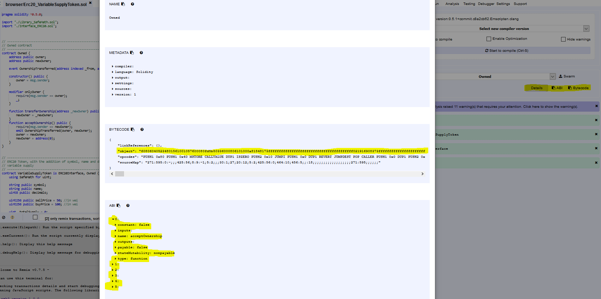

# GenToken Client

## Generell

Der GenToken Client wurde von uns aufgesetzt um über eine externe Anwendung mit der Ethereum Blockchain zu interagieren.
Die Kommunikation zur Blockchain erfolgt dabei über web3.js, einer Javascript API für die Ethereum Blockchain.


## Dependencies

- [Web3js v1.0 minified](https://github.com/ethereum/web3.js/blob/1.0/dist/web3.min.js) die offizielle Api Beschreibung finden Sie [hier](https://web3js.readthedocs.io/en/1.0/index.html) 
- Metamask als Provider

## Web3js

Die Web3js Javascript Ethereum Api bietet uns eine Reihe von Funktionen an um mit der Ethereum Blockchain zu interagieren, beispielweise um Contracts zu deployen, Transaktion oder Konstante Methoden (Führen keine Zustandsänderungen im Contract durch) auf deployten Contracts auszuführen, oder über Listener auf Blockchain Actionen, wie die Erzeugung eines neuen Blocks zu reagieren.
Darüber hinaus bietet Web3js noch eine Reihe weitere Funktionalitäten, wie z.B. eine Utils Klasse mit Hilfsfunktionen, oder die Möglichkeit mittels eines Batch Requests mehrere Blockchain Anfragen in einem Http Request zu bündeln.
Da wir __Stand 15.12.2018__ dieses Funktionalitäten nicht benötigten werden wir auf diese Möglichkeiten nicht weiter darauf eingehen.


#### Das Web3js Object

Das Web3js Object ist ein Container Object das sämtliche Module von Web3 beinhaltet.I. d. R. wird bei der Instanzierung Web3 Objektes ein Provider übergeben.
Bei der Instanzierung des Web3 Objektes sowie dessen Modulen, kann die Konfiguration über Übergabeparameter des Konstruktors erfolgen.
Zur Übersichtlichkeit verzichten wir in dieser Dokumentation soweit möglich auf diese Möglichkeit, um das Vorgehen der einzelnen Schritte zu verdeutlichen.
Die Konfigurationsparameter und dessen Rheinfolge ist auf der Offiziellen Dokumentation von Web3js nachlesbar. Eine blanke Instanzierung sieht in unserem Fall wie folgt aus:
```
var web3 = new Web3( );
```


#### Kommunikation mit der Ethereum Blockchain

Die Kommunikation mit einem Provider kann über Websockets oder http in verschlüsselter sowie unverschlüsselter Form erfolgen.
Da Wir in unserem Fall auf das Tool Metamask zurückgreifen ist die Definition eines eigenen Providers nicht notwendig. 
Wir setzen stattdessen 'Web3.givenProvider' als Provider so wird Metamask, sofern installiert und eingerichtet, erkannt und dessen Konfigurationen übernommen.
````   
  web3.setProvider(Web3.givenProvider );
````

#### Interaktion mit einem Contract

Um einem Contract zu deployen oder mit einem zu interagieren, müssen wir Web3 die Signaturbeschreibungen des Contracts (Abi), den ByteCode des Contracts, sowie die Contractaddresse beim interagieren oder die Nodeadresse beim deployen mitteilen.
Der einfachste Weg ist dabei wohl den Contract mittels Remix zu compilieren und die obrigen Informationen in variablen zwischenzuspeichern.



#####Deployment eines Contracts 

[Dokumentation](https://web3js.readthedocs.io/en/1.0/web3-eth-contract.html)

Ein Deployment eines Contracts auf die eigene Account Node könnte dabei wie folgt aussehen:
````
var byteCode = "Inhalt des ByteCode.object"
var abi = "abi"
var accountAddress = "unsere Account Adresse";
myContract = new web3.eth.Contract(abi);
````
Die weitere Konfiguration nehmen wir in diesem Beispiel nach der Instanzierung des Contracts vor:

````
myContract.options.adress = "unsere Account Adresse;
````
Mit der deploy Methode können wir den Contract nun deployen, wir müssten in dem Field data allerdings noch den ByteCode des Contracts übergeben! Da es
Sich beim Deployment um eine Transaktion handelt, die eine Zustandänderung des Knotens herbeiführt, müssen wir noch eine Menge von gas übermitteln die das Deployment kostet.
Als Faustregel sind dabei __minimale Kosten von 32000 gas + 200 gas pro Byte in wei__ heranzuziehen.Außerdem müssen wir noch unsere Adresse als Absender angeben angegeben. Diese Einstellung nehmen wir in der Methode send for 

````
myContract.deploy({
data: byteCode
})
.send({
from: "unsere Account Adresse"
gas: 3000000,
gasPrice: '30000000000000'
}).then{(function(newContractInstance){

myContract = newContractInstance;
console.log(newContractInstance.options.adress);
});
```` 
Als letzten Schritt müssen wir nun noch die Transaktion in Metmask bestätigen. Hat unser Deployment funktioniert so sollte nun die Deploymentadresse unseres deployten Contracts in der Javascript Console ausgegeben werden.


##### Sende Transaktion an einen Contract

Im oberen Fall haben wir ein Contract bereits deployt, daher steht uns das gefüllte web3.eth.contract bereits zu Verfügung.
 Ansonsten müsste man das Contract Objekt erst mit den nötigen Informationen, wie der Contractadresse instanzieren, bevor mit den nächsten Punkt fortgefahren werden kann.


Nachdem dem web3.eth.contract Objekt bei der Instanziierung die Signaturbeschreibung (abi) übergeben wurde erzeugt web3 ein Array der Methoden unter web3.eth.contract.methods.
Unter der Annahme Es wurde der Contract VariableSupplyToken [siehe](../contracts/Token_Impl/Erc20_VariableSupplyToken.sol) deployed, so würde eine Transaktion der  buy Methode wie folgt aussehen.

````
myContract.buy().send({ from: "unsere Account Adresse", gas:1500000, value:1500000 }).on('transactionHash', function(hash){
console.log(hash);
}.on('confirmation', console.log("Transaction is confirmed");
````
Im nächsten Schritt müsste die Transaktion noch in Metmask bestätigen. Hat alles funktioniert sollte nun auf der Kommandozeile der Transaktionshash, und nach der Bestätigung der Blockchain der Text ausgegeben werden.

##### Aufruf einer Konstanten Methode eines Contracts (Keine Zustandänderung)

Dieses Beispiel ist im Vorgehen zu großen Teilen Equivalent zu dem vorherigen Absatz mit dem unterschied das wir die Methode call anstatt send aufrufen wird und da es sich um keine Transaktion handelt auch nicht Metmask zur Bestätigung benötigt wird. In diesem Beispiel möchten wir die Methode balanceOf des ERC20 Interfaces aufrufen.

````
myContract.balanceOf("Adress TokenOwner").call({from: "unsere Account Adresse"}, function(error,result){

console.log(error,result)
});
````    

Ein Komplettes Codbeispiel dieser Dokumentation finden Sie [hier](examples/Web3_Example.html)

Neben dem Codebeispiel haben wir noch weitere Beispielseiten erzeugt, und auf einem Webserver deployed:

- [Web3_Example](https://math2i.bounceme.net/gentoken-client/examples/Web3_Example.html)
- [buyTokens](https://math2i.bounceme.net/gentoken-client/examples/buyTokens.html)
- [Deploy Contract](https://math2i.bounceme.net/gentoken-client/examples/deploy.html)
- [subscripe new Blockchain Blocks](https://math2i.bounceme.net/gentoken-client/examples/deploy.html)
- [Database](https://math2i.bounceme.net/gentoken-client/examples/Database.html)
- [Aquarium]https://math2i.bounceme.net/gentoken-client/Aqua.html)